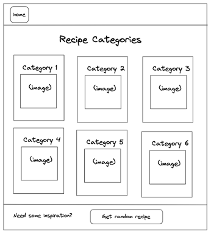
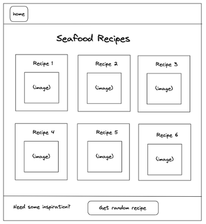
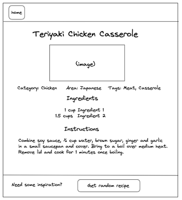
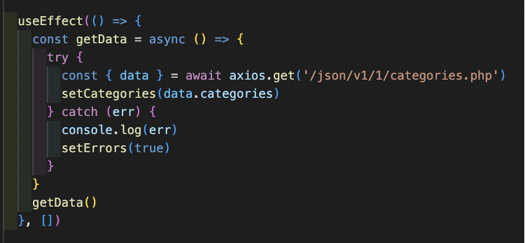
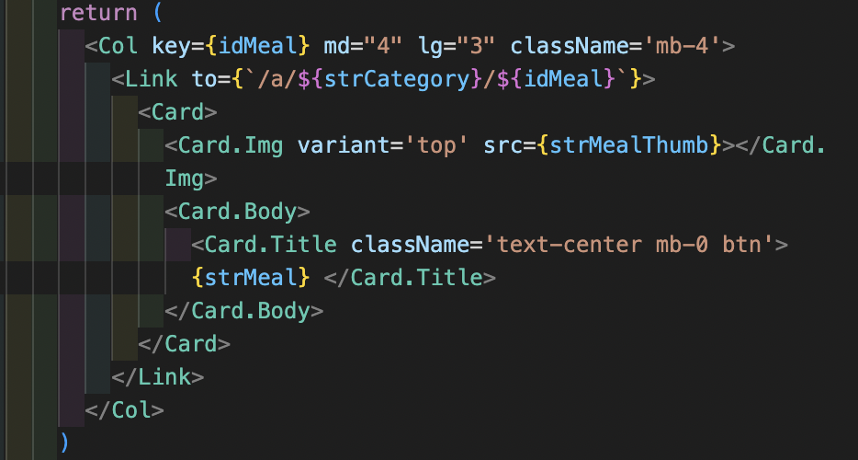
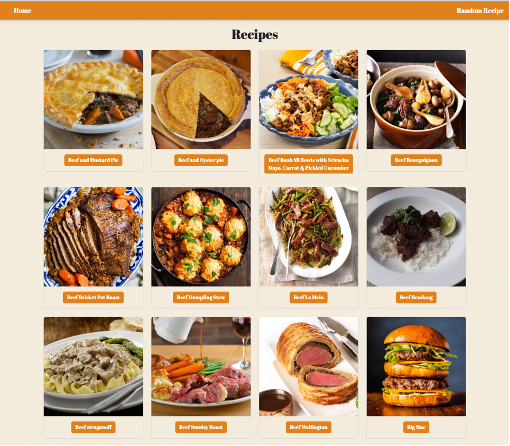
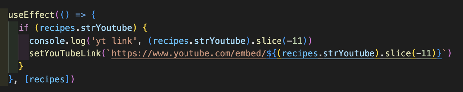
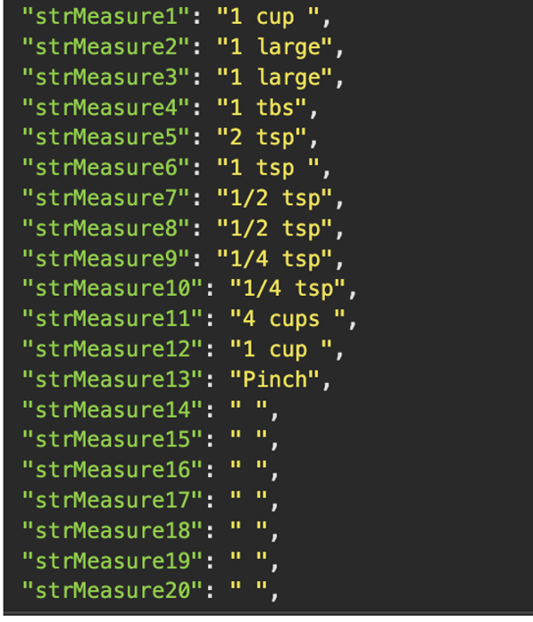
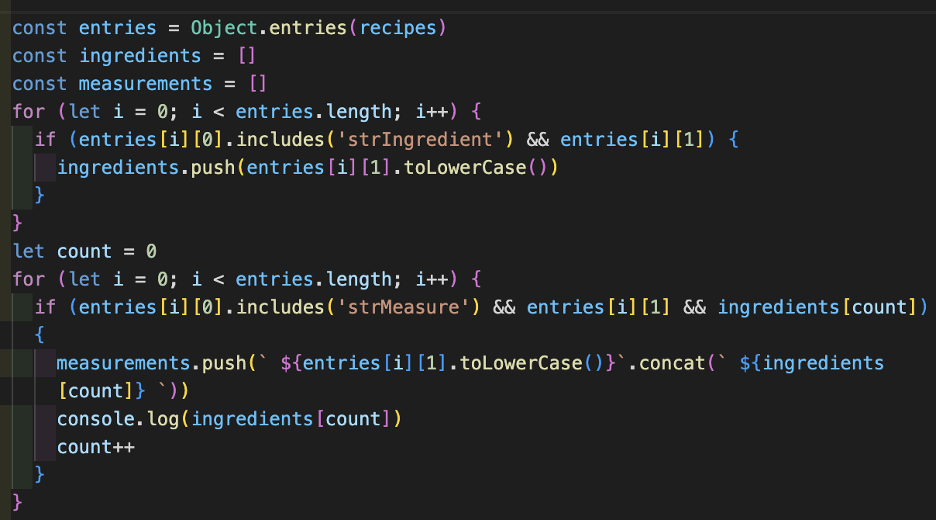

# Recipe App: React App Using a Third-Party API

# Table of contents
* [Project Overview](#project-overview)
* [Deployment Link](#deployment-link)
* [Timeframe and Team](#timeframe-and-team) 
* [Technologies Used](#technologies-used)
* [Brief](#brief) 
* [Planning](#planning)
* [Build Process](#build-process)
* [Challenges](#challenges)
* [Wins](#wins)
* [Key Learnings](#key-learnings)
* [Bugs](#bugs)
* [Future Improvements](#future-improvements) 

# Project Overview

This is the second project I did for a Software Engineering Immersive course through General Assembly London. I worked with [Joe Rose](https://github.com/JRose117). In this app, users can navigate through categories of recipes to individual recipes, or jump to a randomly selected recipe. 

# Deployment Link

The app has been deployed with Netlify and is available [here.](https://react-recipe-app-2-day-project.netlify.app/)

# Timeframe and Team

* 2 day timeframe
* Joe Rose (https://github.com/JRose117)

# Technologies Used 

__Front-End__

* Axios
* CSS3
* HTML5
* JavaScript
* JSX
* Microsoft Visual Studio Live Share
* React Bootstrap 
* React Router DOM
* React.js
* Sass

__Deployment__ 

* Netlify 

__Other__

* Chrome developer tools
* Excalidraw
* Git & GitHub
* Insomnia
* YouTube

# Brief

* Build a React application that consumes a public API.
* The application should have several components and a router with several pages. 

# Planning

* We brainstormed ideas and found a public API that had endpoints for categories of recipes and individual recipes. The API documentation is available at https://www.themealdb.com/. We used Excalidraw to create wireframes of our home page with all the categories, a page where the recipes are filtered by category, and a single recipe page. 

	* All Recipe Categories Wireframe
 

	* Single Category of Recipes Wireframe
 

	* Single Recipe Wireframe
 

* We would need the following components for our app: Nav Bar, Category Index, Single Category, Single Recipe, Random Page, and Not Found. The Category Index page was our landing page that showed all the recipe categories returned from the API. Clicking on a category navigates to the Category Single page. We used a different API endpoint that returned recipes filtered by category. From there, clicking on a recipe navigates to the Recipe Single page. There we would display the recipe image, ingredients, and instructions. There is an API endpoint that returns a random recipe ID. One of our stretch goals was to add a button using the randomly generated ID to navigate to that recipe. 

# Build Process

* We worked through the entire project together over Zoom. For the app, I coded while Joe followed along using Microsoft Visual Studio Live Share. For the styling, we used the same process but Joe coded while I followed along.

* First, we created our React app and linked our App.js and Index.js. We made components for each of our pages. We set up our BrowserRouter and imported the components to the App.js. 

* Using Insomnia, we tested the links from our API. We used AJAX to make the async Axios requests in a try catch block to import the API data. This was executed inside a UseEffect that only triggered on the initial page load. This same process was repeated on the pages to get all categories, a single category, a single recipe, and a random recipe. Here is an example of one of our Axios requests:

	* Example Axios Request
 

* We used React Bootstrap cards to style the pages with multiple categories and multiple recipes. We made text size responsive and added a media query for larger screens. A screenshot of the JSX for a recipe card is shown below with a multiple recipe page populated with recipe cards:

	* Recipe Card JSX
 

	* Example Recipe Cards
 

* The data returned for the single recipes had ingredients and measures split into multiple strings of numbers and strings of text with the ingredient names. To generate a list of ingredients matching the measurements to the name, we made an array of the measurements and then iterated through and concatenated the corresponding text to the end of each array item. A more detailed description of this code is highlighted in the #Challenges section.

* We made another component Pan, with a GIF of a pan flipping food to show while the pages were loading. We added a ternary that checked if the API data was loaded. If it was, it displayed our page component. There was another ternary nested so if there was no data AND there were errors, it displayed an error message. If there was no data but no errors, it would display the page loading pan GIF.

* The YouTube links we needed to use to embed the videos were different from the YouTube links the API data returned. We were able to convert the links and add them into the JSX of the recipe page. A detailed description of the process we used is below in the #Wins section.

# Wins

* We wanted to display the YouTube videos on the recipe page because the YouTube thumbnails were usually more visually appealing than the other recipe images and videos encourage the user to stay on the page longer. 

* The link format for embedded videos is different from the standard YouTube link format, but the last 11 characters of the links are the unique video identifiers. We used .slice()to take the unique end of the API YouTube link and add if to the embedded link format. We then took that link and put it inside an inline frame HTML element to display it. 

	* Code to Embed YouTube Links
 

# Challenges 

* The ingredient list on our app looks straight forward in the deployed project, but the code to display the ingredients was a JavaScript challenge for us. The data returned strings of ingredients (ex: “strIngredient1”: “Lentils”) and strings of strings of measurements (ex: “strMeasure1: “1 cup”). The strings could number up to 20, but not all recipes had that many ingredients. We used Object.entries()to get an array of the key-value pairs of the recipe data and then iterated through returning and keys that contained “strIngredient” whose values weren’t null and pushed them to a new array of all the ingredient names. 

	* Measurement Strings
 

	* Ingredient Strings
 

* We made a similar array for the measurements, but concatenated the ingredients to the end of the measurements string before pushing them to the new array. We set up a count inside of the loop to increase after each iteration. If the index of the current count in the ingredient name array was null, the iteration stopped so we wouldn’t iterate through the extra empty measurement strings.  

	* Loops to Display Ingredients
 

# Key Learnings

* We had trouble at first getting data back and we thought we needed to use a proxy to get a response from our API. So we set up a proxy, and used it while working on the project. When we went to deploy, we realized we originally had trouble because we were trying to access the API using an http:// request rather than the secure https:// and the proxy was unnecessary. 
* After selecting our API and starting the project, we realized there wasn’t a request we could make that would return all of the recipes. This would make a search bar trickier and we would have to do multiple requests. It’s one of the ways we were limited by the “Freemium” content of our free API.  In projects I did later where I was building my own APIs, this struggle made me really appreciate being able to create endpoints returning exactly the data I needed for specific requests. 

# Bugs

* When users make a request that doesn’t match any other endpoints, the app displays a blank page rather than our 404-page component. 

* There are some YouTube links from the API that have been deleted or made private. We don’t have anything in our code that checks the link validity so the broken links are still displayed. 

# Future Improvements

* I would like to add a search bar that could return results from matching recipe names and ingredients.
